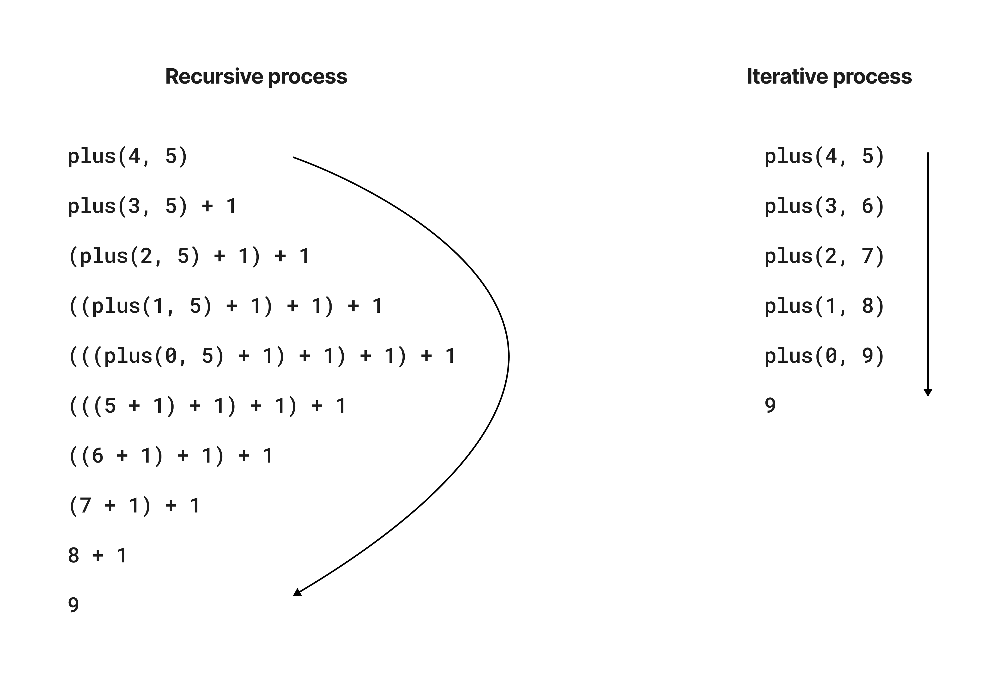
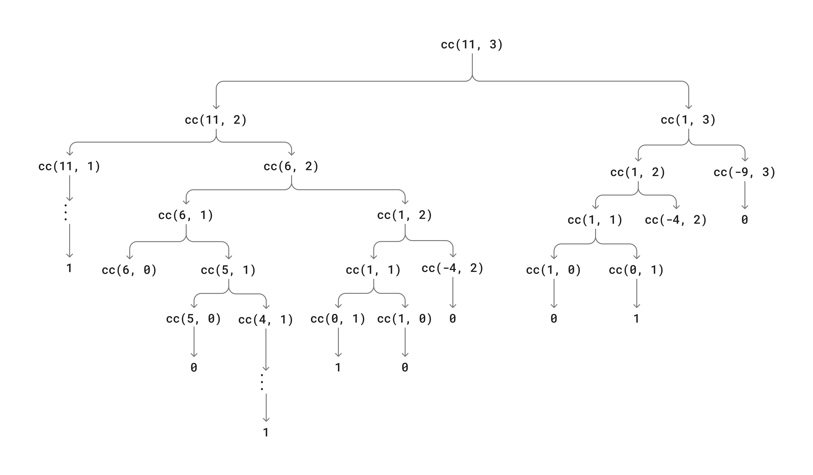

## Exercise 1.9



## Exercise 1.10

- function 1:

  ```{javascript}
  function f(n) {
    return A(0, n);
  }
  ```
  The math expression of `f(n)` is: $2n$

- function 2:

  ```{javascript}
  function g(n) {
    return A(1, n);
  }
  ```
  Expansion:
  ```
  A(1, n)
  A(0, A(1, n - 1)) = 2 * A(1, n - 1)
  2 * A(0, A(1, n - 2)) = 2 * 2 * A(1, n - 2)
  ...
  2 * 2 * 2 * 2 * ... * A(1, 0) = 2 * 2 * 2 * 2 * ... * 2

  ```

  Therefore, the math expression of `g(n)` is: $2^n$

- function 3:

  ```{javascript}
  function h(n) {
    return A(2, n);
  }
  ```
  Expansion:
  ```
  A(2, n)
  A(1, A(2, n - 1)) = 2 ** (A(2, n - 1))
  2 ** 2 * (A(1, n - 2)) = 2 ** (2 ** A(2, n - 2))
  ...
  2 ** (2 ** (2 ** (2 ** (...** (2 * 0)...)))) 
  ```
  Therefore, the math expression of `h(n)` is: $^{(n-1)}2 = 2 ^{2^{2^{\cdot ^{\cdot ^{2}}}}}$

- function 4:

  ```{javascript}
  function k(n) {
    return 5 * n * n;
  }
  ```
  The math expression of `k(n)` is: $5n^2$

## Exercise 1.13

**Step 1**\
We assume that $Fib(n) = r ^n$, and the recursive format of $Fib(n)$ can be expressed as:\
$$r^n = r^{n - 1} + r ^ {n - 2}$$
Assuming that $r \neq 0$, we divide both sides by $r^{n - 2}$, and get:
$$r^2 = r + 1$$
Given that in the quadratic formula $ax^2 + bx + c = 0$:

$$
x = \frac{-b \pm \sqrt{b^2 - 4ac}}{2a}
$$

We can solving the equation:

$$r = \frac{1 \pm \sqrt{5}}{2}$$

Then we can denote each solution as:

$$
\phi = \frac{1 + \sqrt{5}}{2}, \quad
\psi = \frac{1 - \sqrt{5}}{2}
$$

**Step 2**\
The Fibonacci sequence if a linear homogeneous recurrence relation of the second degree, its general solution is a linear combination of the solutions found:

$$
Fib(n) = A(\phi^n) + B(\psi^n)
$$

For $n = 0, Fib(0) = 0$ and $n = 1, Fib(1) = 1$, we can find the values of $A$ and $B$:

$$
A + B = 0 \\
A\phi + B\psi = 1 \\
A = \frac{1}{\sqrt{5}}, \quad B = -\frac{1}{\sqrt{5}}
$$

**Step 3**\
Now we subsitute $A$ and $B$ back into the general solution:

$$
Fib(n) = \frac{1}{\sqrt{5}}\phi^n - \frac{1}{\sqrt{5}}\psi^n = \frac{\phi^n - \psi^n}{\sqrt{5}} 
$$

With n increasing, $\psi^n$ will gradually approaching 0, therefore $Fib(n)$ is the closest integer to $\phi^n / \sqrt{5}$

## Exercise 1.14



The step has $\Theta(2^N)$ order of growth, where $N$ is the target amount;\
The order of growth of the space is $\Theta(N \cdot m)$, where $N$ is the target amount and $m$ is the number of coin dominations, because each combination of amount and coin denomication is calculated only once.

## Exercise 1.15

The number of steps of `sine(angle)` is $\Theta(\log_3\frac{N}{m})$, where $N$ is the angle, and $m$ is the precision; \
The space complexity is also $\Theta(\log_3\frac{N}{m})$, reflecting the depth of the recursive calls. 